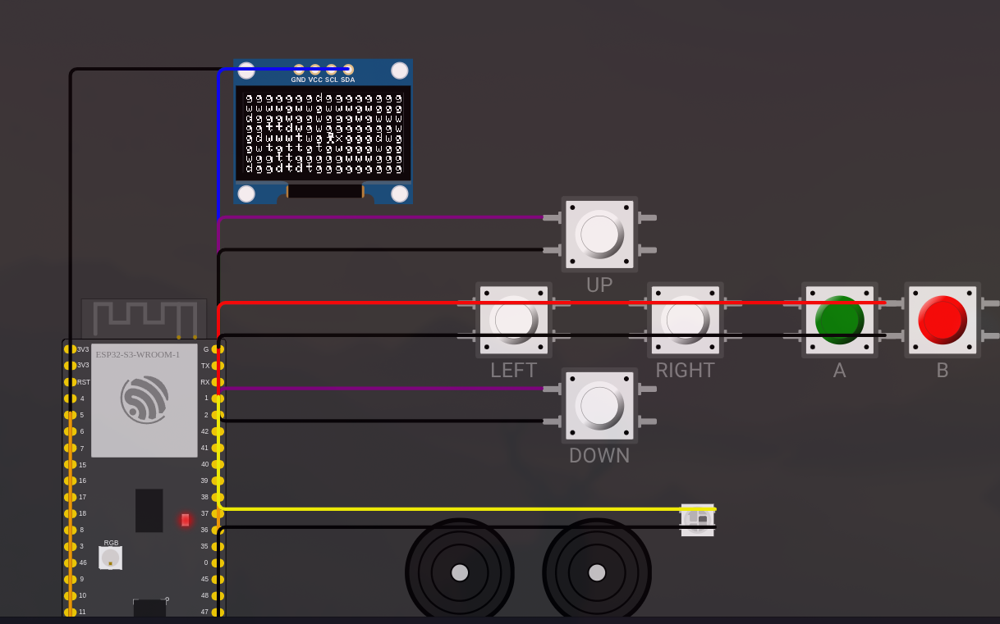

# TouchGrass

A tile-based exploration game for ESP32-S3 with SH1106 OLED display.



## Hardware Requirements

- ESP32-S3 microcontroller
- SH1106 128x64 OLED display (I2C)
- 6-button D-pad (UP/DOWN/LEFT/RIGHT) + A/B buttons
- Dual buzzers for audio
- WS2812B RGB LED

### Pin Configuration

| Component | GPIO |
|-----------|------|
| D-pad UP/DOWN/LEFT/RIGHT | 38/35/36/37 |
| Button A/B | 19/20 |
| Buzzers | 5, 40 |
| RGB LED | 1 |
| OLED SDA/SCL | 41/42 |

## Build

Requires [arduino-cli](https://arduino.github.io/arduino-cli/) with ESP32 board support.

```bash
# Build firmware (outputs to build/)
arduino-cli compile --fqbn esp32:esp32:esp32s3 --output-dir build TouchGrass.ino

# Watch for changes and auto-rebuild
./watch.sh
```

## Simulator

Run in the [Wokwi](https://wokwi.com/) simulator:

```bash
wokwi-cli .
```

## Game Controls

- **D-pad**: Move player around the world
- **A button**: Interact/Select
- **B button**: Back/Cancel

## Project Structure

- `TouchGrass.ino` - Main game loop and state machine
- `shared/` - Hardware abstraction, graphics, and sound utilities
- `touch_grass/` - Game-specific terrain generation and sprites
